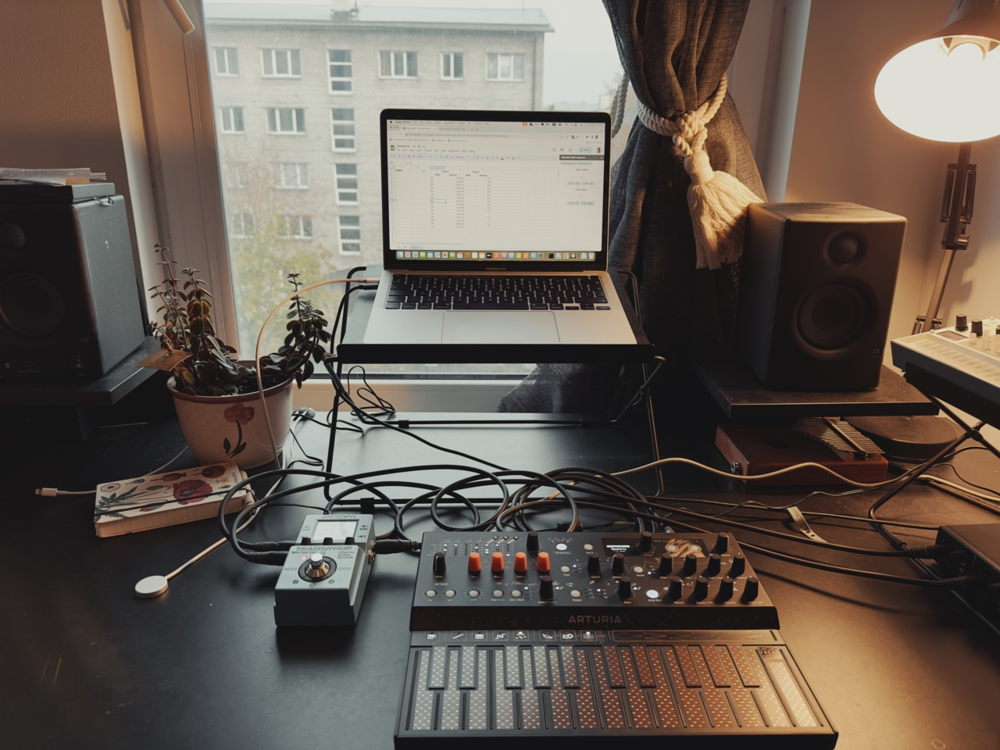

# Google Sheets as 2 tracks MIDI sequencer

We can extend the functionality of Google Sheets via [Apps Script](https://developers.google.com/apps-script). This repository is a proof of concept to use Google Sheets as a MIDI sequencer. I built a custom sidebar UI for Google Sheets, and access WebMIDI API from there. Then, I connected my synthesizer via USB cable to the laptop. The script can read and send the MIDI data from Google Sheets cell and pass it to the synthesizer.

## The video demo

